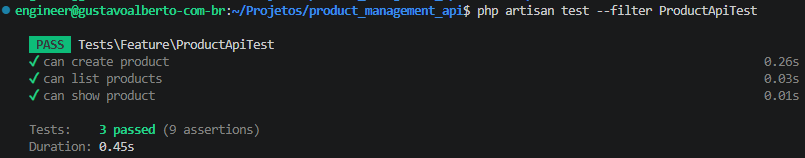

# product_management_api

API REST para gerenciamento de produtos com Laravel 11.

## Requisitos
- PHP 8.2+
- Composer
- SQLite (padrão) ou MySQL (opcional)

## Instalação Rápida

```bash
# 1. Clone o repositório
git clone https://github.com/GusAlberto/product_management_api.git
cd product_management_api

# 2. Instale as dependências
composer install

# 3. Configure o arquivo de ambiente
cp .env.example .env

# 4. Gere a chave da aplicação
php artisan key:generate

# 5. Configure o banco (veja seção abaixo)

# 6. Execute as migrações
php artisan migrate

# 7. Inicie o servidor
php artisan serve
```

A aplicação estará disponível em `http://localhost:8000`.

## Configuração do Banco de Dados

### SQLite (Recomendado para Desenvolvimento Local)

**Padrão**: O projeto já está configurado para usar SQLite. Só precisa criar o arquivo de banco:

```bash
# Criar o arquivo SQLite
touch database/database.sqlite

# Executar as migrações
php artisan migrate
```

**Verificar se PHP suporta SQLite**:
```bash
php -m | grep -i sqlite
```

Se não aparecer `pdo_sqlite`, instale (Debian/Ubuntu):
```bash
sudo apt update && sudo apt install -y php8.3-sqlite3 sqlite3
```

### MySQL (Opcional)

Se preferir usar MySQL localmente, há um arquivo `docker-compose.yml` de conveniência.

**Opção 1: Usar Docker Compose**
```bash
# Inicie o MySQL
docker compose up -d

# Configure o .env
cat > .env << EOF
DB_CONNECTION=mysql
DB_HOST=127.0.0.1
DB_PORT=3306
DB_DATABASE=desafio_produtos
DB_USERNAME=root
DB_PASSWORD=root
EOF

# Execute as migrações
php artisan migrate
```

**Opção 2: Usar docker run (sem plugin compose)**
```bash
# Inicie o container MySQL
docker run -d --name desafio_produtos_db \
  -e MYSQL_ROOT_PASSWORD=root \
  -e MYSQL_DATABASE=desafio_produtos \
  -p 3306:3306 \
  mysql:8.0

# Configure o .env (como acima)

# Execute as migrações
php artisan migrate
```

## Rodando os Testes

```bash
# Todos os testes
php artisan test

# Apenas o teste de produtos
# Apenas os testes de produto (use o filtro por padrão 'Product')
php artisan test --filter Product

# Executar todos os testes de feature
php artisan test --testsuite=feature

# Executar arquivos de testes específicos
./vendor/bin/phpunit tests/Feature
```



## Endpoints da API

### Listar Produtos
```bash
GET /api/products?name=mouse&min_price=50&max_price=200&min_stock=1&page=1&per_page=10
```

### Criar Produto
```bash
POST /api/products
Content-Type: application/json

{
  "name": "Mouse Gamer",
  "description": "Mouse com 6 botões",
  "price": 199.90,
  "stock": 25
}
```

### Obter Produto Específico
```bash
GET /api/products/{id}
```

### Atualizar Produto
```bash
PUT /api/products/{id}
Content-Type: application/json

{
  "name": "Mouse Gamer RGB",
  "description": "Mouse com 6 botões RGB",
  "price": 249.90,
  "stock": 15
}
```

### Deletar Produto
```bash
DELETE /api/products/{id}
```

## Estrutura do Projeto

```bash
/home/engineer/Projetos/product_management_api/
├── app/
│   ├── Http/Controllers/     # Controllers da API
│   ├── Models/               # Modelos Eloquent
│   └── Traits/               # Traits reutilizáveis
├── database/
│   ├── migrations/           # Migrações do banco
│   ├── factories/            # Factories para testes
│   └── database.sqlite       # Arquivo SQLite (criado automaticamente)
├── routes/
│   ├── api.php               # Rotas da API
│   ├── web.php               # Rotas web
│   └── console.php           # Comandos console
├── tests/
│   ├── Feature/              # Testes de funcionalidade
│   └── Unit/                 # Testes unitários
├── .env                      # Variáveis de ambiente
├── artisan                   # CLI do Laravel
├── composer.json             # Dependências PHP
└── README.md                 # Este arquivo
```

## Filtros de Busca

A endpoint `GET /api/products` aceita os seguintes filtros:

- `name`: Filtro por nome do produto
- `min_price`: Preço mínimo
- `max_price`: Preço máximo
- `min_stock`: Estoque mínimo
- `max_stock`: Estoque máximo
- `page`: Número da página (padrão: 1)
- `per_page`: Itens por página (padrão: 10)

**Exemplo**:
```bash
GET /api/products?name=mouse&min_price=100&max_price=300&page=1&per_page=5
```

